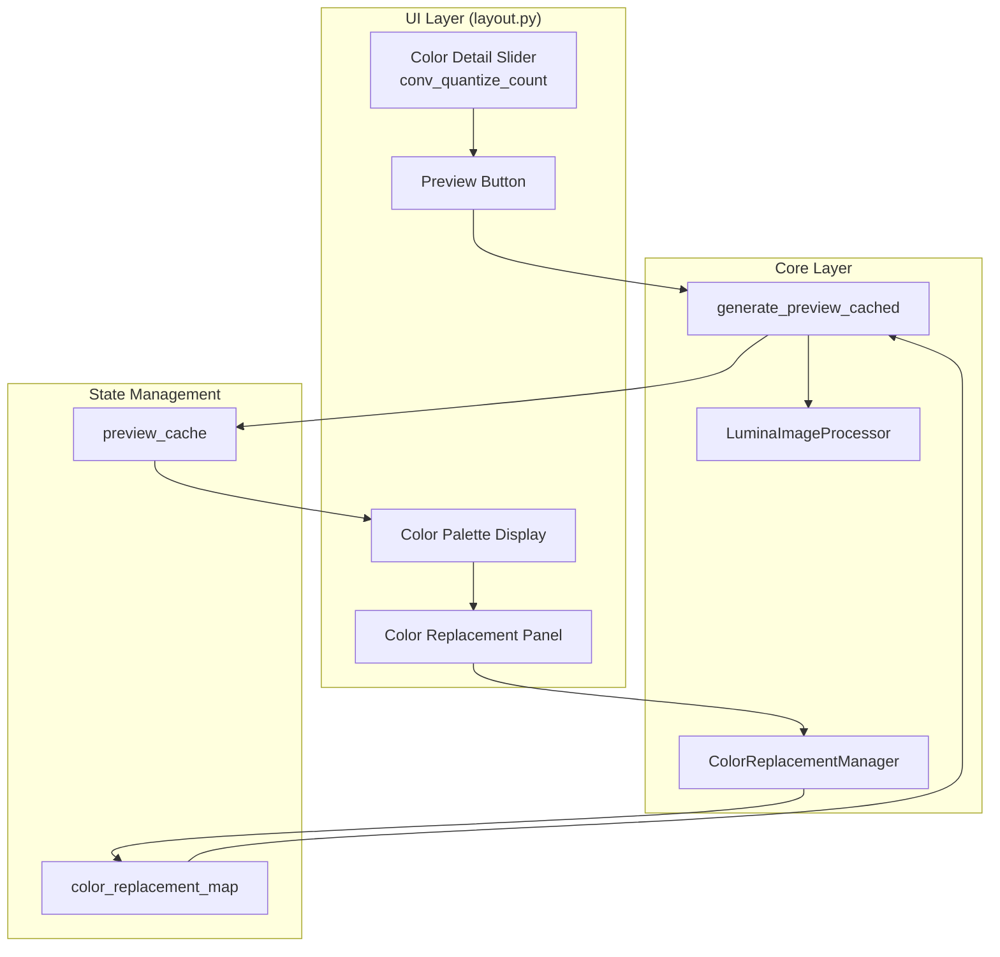

# Design Document: Preview Color Enhancement

## Overview

本设计文档描述了 Lumina Studio 预览颜色增强功能的技术实现方案。该功能包含两个核心改进：

1. **预览色彩细节同步**：将 UI 中的"色彩细节"滑块值传递给预览生成函数
2. **颜色置换系统**：提供颜色调色板显示、颜色选择和替换功能

### 设计原则

- **渐进式设计**：最小化对现有代码的修改，复用现有的图像处理管道
- **开发者体验**：保持 API 简洁直观，与现有代码风格一致
- **性能优先**：颜色置换操作应在毫秒级完成，不阻塞 UI

## Architecture



### 数据流

1. **预览生成流程**：
   - 用户调整 Color Detail Slider → 点击预览按钮
   - `generate_preview_cached` 接收 `quantize_colors` 参数
   - 调用 `LuminaImageProcessor.process_image()` 处理图像
   - 返回预览图像和缓存数据

2. **颜色置换流程**：
   - 从缓存中提取唯一颜色 → 显示调色板
   - 用户选择颜色 → 选择替换颜色
   - 存储到 `color_replacement_map`
   - 重新渲染预览 / 生成最终模型时应用替换

## Components and Interfaces

### 1. 修改 `generate_preview_cached` 函数签名

**文件**: `core/converter.py`

```python
def generate_preview_cached(
    image_path,
    lut_path,
    target_width_mm,
    auto_bg,
    bg_tol,
    color_mode,
    modeling_mode: ModelingMode = ModelingMode.HIGH_FIDELITY,
    quantize_colors: int = 64,  # 新增参数，默认值与 UI 滑块一致
    color_replacement_map: dict = None  # 新增参数，颜色置换映射
):
    """
    Generate preview and cache data.

    Args:
        ...existing args...
        quantize_colors: K-Means quantization color count (8-256)
        color_replacement_map: Dict mapping original RGB tuples to replacement RGB tuples

    Returns:
        tuple: (preview_image, cache_data, status_message)
    """
```

### 2. 新增 `ColorReplacementManager` 类

**文件**: `core/color_replacement.py` (新文件)

```python
class ColorReplacementManager:
    """
    Manages color replacement mappings for preview and final model generation.
    """

    def __init__(self):
        self._replacements: Dict[Tuple[int, int, int], Tuple[int, int, int]] = {}

    def add_replacement(self, original: Tuple[int, int, int],
                       replacement: Tuple[int, int, int]) -> None:
        """Add or update a color replacement mapping."""
        pass

    def remove_replacement(self, original: Tuple[int, int, int]) -> bool:
        """Remove a color replacement. Returns True if found and removed."""
        pass

    def get_replacement(self, original: Tuple[int, int, int]) -> Optional[Tuple[int, int, int]]:
        """Get replacement color for original, or None if not mapped."""
        pass

    def apply_to_image(self, rgb_array: np.ndarray) -> np.ndarray:
        """Apply all replacements to an RGB image array."""
        pass

    def clear(self) -> None:
        """Clear all replacements."""
        pass

    def to_dict(self) -> Dict:
        """Export replacements as serializable dict."""
        pass

    @classmethod
    def from_dict(cls, data: Dict) -> 'ColorReplacementManager':
        """Create manager from serialized dict."""
        pass
```

### 3. 新增 `extract_color_palette` 函数

**文件**: `core/converter.py`

```python
def extract_color_palette(preview_cache: dict) -> List[dict]:
    """
    Extract unique colors from preview cache.

    Args:
        preview_cache: Cache data from generate_preview_cached

    Returns:
        List of dicts with keys:
        - 'color': (R, G, B) tuple
        - 'hex': '#RRGGBB' string
        - 'count': pixel count
        - 'percentage': percentage of total pixels
    """
```

### 4. UI 组件更新

**文件**: `ui/layout.py`

新增 UI 组件：

- `conv_color_palette`: Gallery 组件显示颜色调色板
- `conv_selected_color`: State 存储当前选中的颜色
- `conv_replacement_picker`: ColorPicker 选择替换颜色
- `conv_replacement_map`: State 存储颜色替换映射
- `conv_apply_replacement`: Button 应用颜色替换
- `conv_clear_replacements`: Button 清除所有替换

## Data Models

### PreviewCache 扩展

```python
cache = {
    # 现有字段
    'target_w': int,
    'target_h': int,
    'mask_solid': np.ndarray,  # (H, W) bool
    'material_matrix': np.ndarray,  # (H, W, Layers) int
    'matched_rgb': np.ndarray,  # (H, W, 3) uint8
    'preview_rgba': np.ndarray,  # (H, W, 4) uint8
    'color_conf': dict,

    # 新增字段
    'quantize_colors': int,  # 使用的量化颜色数
    'color_palette': List[dict],  # 提取的调色板
    'color_replacement_map': dict,  # 颜色替换映射 {(R,G,B): (R,G,B)}
    'original_matched_rgb': np.ndarray,  # 替换前的原始匹配颜色
}
```

### ColorPaletteEntry

```python
{
    'color': (int, int, int),  # RGB tuple
    'hex': str,  # '#RRGGBB'
    'count': int,  # pixel count
    'percentage': float,  # 0.0-100.0
    'replaced_by': Optional[Tuple[int, int, int]],  # replacement color if any
}
```

## Correctness Properties

_A property is a characteristic or behavior that should hold true across all valid executions of a system—essentially, a formal statement about what the system should do. Properties serve as the bridge between human-readable specifications and machine-verifiable correctness guarantees._

### Property 1: Quantize Colors Parameter Propagation

_For any_ valid quantize_colors value (8-256) passed to `generate_preview_cached`, the underlying `LuminaImageProcessor.process_image()` SHALL receive and use that exact value for K-Means quantization.

**Validates: Requirements 1.1, 1.2, 1.3**

### Property 2: Color Count Bounded by Quantize Colors

_For any_ image and any quantize_colors value N, the number of unique colors in the resulting preview image (after LUT matching) SHALL be at most N.

**Validates: Requirements 1.4**

### Property 3: Palette Extraction Completeness

_For any_ preview image, the extracted color palette SHALL contain exactly the set of unique colors present in the `matched_rgb` array, and the sum of all pixel counts in the palette SHALL equal the total number of solid pixels (where `mask_solid` is True).

**Validates: Requirements 2.1, 2.3**

### Property 4: Palette Sorting Invariant

_For any_ color palette with more than one entry, each entry's pixel count SHALL be greater than or equal to the next entry's pixel count (descending order).

**Validates: Requirements 2.4**

### Property 5: Color Replacement Map CRUD Consistency

_For any_ sequence of add/remove operations on `ColorReplacementManager`:

- After `add_replacement(A, B)`, `get_replacement(A)` SHALL return B
- After `remove_replacement(A)`, `get_replacement(A)` SHALL return None
- After N distinct `add_replacement` calls, the map SHALL contain exactly N entries

**Validates: Requirements 3.3, 3.4, 3.6**

### Property 6: Color Replacement Application

_For any_ image with color replacements defined, when generating the final model:

- All pixels matching a replaced color SHALL have their material assignment based on the replacement color's LUT match
- The replacement colors SHALL be re-matched to the LUT (output uses LUT colors, not arbitrary RGB values)

**Validates: Requirements 4.1, 4.2, 4.3, 4.5**

### Property 7: Preview Update Round-Trip

_For any_ color C in the preview and any replacement color R:

- After `add_replacement(C, R)`, the preview SHALL show R (LUT-matched) where C was
- After `remove_replacement(C)`, the preview SHALL revert to showing C

**Validates: Requirements 5.1, 5.4**

## Error Handling

### 输入验证

| 场景                    | 处理方式                            |
| ----------------------- | ----------------------------------- |
| `quantize_colors` < 8   | 自动钳制到 8，记录警告              |
| `quantize_colors` > 256 | 自动钳制到 256，记录警告            |
| 无效的颜色格式          | 抛出 `ValueError`，显示友好错误信息 |
| 空的预览缓存            | 返回空调色板，禁用颜色置换 UI       |

### 颜色匹配边界情况

| 场景                    | 处理方式                       |
| ----------------------- | ------------------------------ |
| 替换颜色与 LUT 距离过远 | 使用最近颜色，在状态栏显示警告 |
| 替换颜色与原颜色相同    | 忽略该替换，不添加到映射       |
| 尝试替换不存在的颜色    | 静默忽略，不影响其他操作       |

### 状态一致性

- 预览重新生成时，保留现有的颜色替换映射
- 如果替换的原始颜色在新预览中不存在，该替换条目保留但不生效
- 清除替换映射时，同步更新预览显示

## Testing Strategy

### 测试框架

- **单元测试**: pytest
- **属性测试**: hypothesis (Python PBT 库)
- **UI 测试**: Playwright (可选，用于端到端验证)

### 单元测试覆盖

1. **ColorReplacementManager 类**
   - 添加/获取/删除替换的基本操作
   - 边界情况：空映射、重复添加、删除不存在的条目
   - 序列化/反序列化 round-trip

2. **extract_color_palette 函数**
   - 空图像返回空列表
   - 单色图像返回单条目
   - 多色图像正确计数和排序

3. **generate_preview_cached 参数传递**
   - quantize_colors 参数正确传递
   - color_replacement_map 正确应用

### 属性测试配置

每个属性测试运行 **100 次迭代**，使用 hypothesis 生成随机输入。

```python
from hypothesis import given, strategies as st, settings

@settings(max_examples=100)
@given(quantize_colors=st.integers(min_value=8, max_value=256))
def test_property_2_color_count_bounded(quantize_colors):
    """
    Feature: preview-color-enhancement
    Property 2: Color Count Bounded by Quantize Colors
    """
    # Test implementation
    pass
```

### 测试数据生成策略

| 数据类型        | 生成策略                                                                   |
| --------------- | -------------------------------------------------------------------------- |
| RGB 颜色        | `st.tuples(st.integers(0, 255), st.integers(0, 255), st.integers(0, 255))` |
| 图像数组        | `st.arrays(np.uint8, shape=(H, W, 3))` with reasonable H, W                |
| 颜色替换映射    | `st.dictionaries(rgb_strategy, rgb_strategy, max_size=10)`                 |
| quantize_colors | `st.integers(min_value=8, max_value=256)`                                  |

### 集成测试

1. **端到端预览流程**
   - 上传图像 → 调整色彩细节 → 生成预览 → 验证颜色数量

2. **颜色置换完整流程**
   - 生成预览 → 选择颜色 → 设置替换 → 验证预览更新 → 生成 3MF → 验证材料分配
